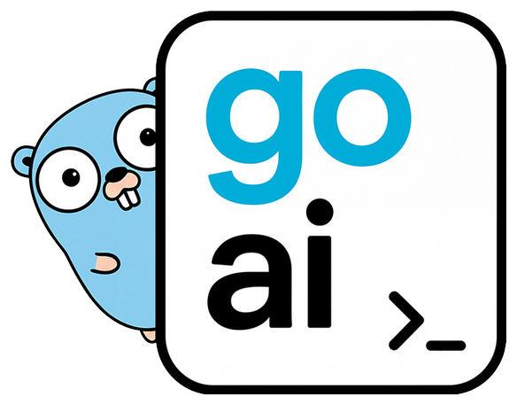

<p align="center">
  <a href="https://goaisdk.com/">
    <picture>
      <source media="(prefers-color-scheme: dark)" srcset="./.github/assets/logo-dark.png">
      <source media="(prefers-color-scheme: light)" srcset="./.github/assets/logo-light.png">
      
    </picture>
  </a>
</p>

<h1 align="center">Go AI SDK</h1>

<p align="center">
  <b>The AI SDK, in Go.</b><br>
  Generate and stream text, call tools, run agents and connect to MCP servers<br>
  across 49 providers, with one API that tracks the TypeScript AI SDK.
</p>

<p align="center">
  <a href="https://github.com/digitallysavvy/go-ai/actions/workflows/ci.yml"></a>
  <a href="https://github.com/digitallysavvy/go-ai/actions/workflows/ci.yml?query=branch%3Amain"></a>
  <a href="https://pkg.go.dev/github.com/digitallysavvy/go-ai"></a>
  <a href="./go.mod"></a>
  <a href="https://github.com/digitallysavvy/go-ai/releases"></a>
  <a href="./LICENSE"></a>
</p>

<p align="center">
  <a href="https://goaisdk.com/docs/getting-started"><b>Get started</b></a>
  &nbsp;·&nbsp;
  <a href="https://goaisdk.com/">Docs</a>
  &nbsp;·&nbsp;
  <a href="./examples">Examples</a>
  &nbsp;·&nbsp;
  <a href="https://goaisdk.com/llms.txt">llms.txt</a>
  &nbsp;·&nbsp;
  <a href="./CHANGELOG.md">Changelog</a>
</p>

```bash
go get github.com/digitallysavvy/go-ai
```

The [Go AI SDK](https://github.com/digitallysavvy/go-ai) is a comprehensive toolkit designed to help you build AI-powered applications and agents using Go. It provides 1:1 feature parity with the [Vercel AI SDK](https://ai-sdk.dev) for backend functionality.

To learn more about how to use the Go AI SDK, check out the [documentation](https://goaisdk.com/).

### What's new in v0.5.0

- **Single-step default** — `GenerateText` / `StreamText` now stop after one step unless you set `StopWhen` (TS parity); use `ai.IsStepCount(n)` or `ai.IsLoopFinished()` to run tool loops. `agent.NewToolLoopAgent` defaults to 20 steps
- **StreamText lifecycle** — `ChunkTypeFinish` now fires once per call (not once per step); each step is bracketed by new `ChunkTypeStartStep` / `ChunkTypeFinishStep` chunks, and `StreamText` itself returns before the first model request
- **xAI Responses-only** — the Chat Completions API is removed; `LanguageModel()` (Responses API) is the only xAI language model
- **Bedrock Converse** — `bedrock.LanguageModel` now calls the Converse API instead of `/invoke`; Bedrock-Anthropic is rebuilt on `anthropic.LanguageModel`
- **Async video** — `ai.ExperimentalStartVideo` / `ExperimentalGetVideoStatus` for fal, Google, Google Vertex, Replicate and xAI, plus Google Vertex Veo support
- **Code-mode (experimental)** — `pkg/codemode` runs model-written JavaScript in a QuickJS-on-WebAssembly sandbox with TS execution-policy limits
- **Harness** — `pkg/harness` (Go port of `@ai-sdk/harness`) with adapters for Claude Code, Codex, OpenCode, Deep Agents, ACP, Cursor, GitHub Copilot, Grok Build, and a Vercel Sandbox provider
- **New providers** — GMI Cloud, Z.AI, MiniMax, TypeSafe AI, Fish Audio, Cartesia, Rev.ai, Hume, Luma, Topaz Labs
- **Security** — tool approvals verified on resume (HMAC v1), DNS-pinned downloads, MCP OAuth SSRF guards

See the full [release notes](./release_notes/RELEASE_NOTES_V0.5.0.md) and [changelog](./CHANGELOG.md), and the [v0.4 → v0.5 migration guide](./docs/08-migration-guides/from-v0.4-to-v0.5.mdx).

## Installation

You will need Go 1.26+ installed on your local development machine.

```bash
go get github.com/digitallysavvy/go-ai@v0.5.0
```

## Unified Provider Architecture

The Go AI SDK provides a [unified API](./docs/02-foundations/02-providers-and-models.mdx) to interact with model providers like [OpenAI](https://platform.openai.com), [Anthropic](https://www.anthropic.com), [Google](https://ai.google.dev), and [more](#supported-providers).

```bash
go get github.com/digitallysavvy/go-ai/pkg/providers/openai
go get github.com/digitallysavvy/go-ai/pkg/providers/anthropic
go get github.com/digitallysavvy/go-ai/pkg/providers/google
```

## Usage

### Generating Text

📖 [Generating text](https://goaisdk.com/docs/ai-sdk-core/generating-text) · [`GenerateText` reference](https://goaisdk.com/docs/reference/ai/generate-text)

```go
import (
    "context"
    "fmt"
    "os"

    "github.com/digitallysavvy/go-ai/pkg/ai"
    "github.com/digitallysavvy/go-ai/pkg/providers/openai"
)

func main() {
    ctx := context.Background()

    provider := openai.New(openai.Config{
        APIKey: os.Getenv("OPENAI_API_KEY"),
    })
    model, _ := provider.LanguageModel("gpt-6-astra")

    result, _ := ai.GenerateText(ctx, ai.GenerateTextOptions{
        Model:  model,
        Prompt: "What is an agent?",
    })

    fmt.Println(result.Text)
}
```

### Streaming Text

📖 [Streaming](https://goaisdk.com/docs/foundations/streaming) · [`StreamText` reference](https://goaisdk.com/docs/reference/ai/stream-text)

```go
stream, _ := ai.StreamText(ctx, ai.StreamTextOptions{
    Model:  model,
    Prompt: "Write a story about Go programming",
})
defer stream.Close()

for chunk := range stream.Chunks() {
    if chunk.Type == provider.ChunkTypeText {
        fmt.Print(chunk.Text)
    }
}
```

### Generating Structured Data

📖 [Generating structured data](https://goaisdk.com/docs/ai-sdk-core/generating-structured-data)

```go
import "github.com/digitallysavvy/go-ai/pkg/schema"

type Recipe struct {
    Name        string   `json:"name"`
    Ingredients []string `json:"ingredients"`
    Steps       []string `json:"steps"`
}

recipeSchema := schema.NewSimpleJSONSchema(map[string]interface{}{
    "type": "object",
    "properties": map[string]interface{}{
        "name":        map[string]interface{}{"type": "string"},
        "ingredients": map[string]interface{}{"type": "array", "items": map[string]interface{}{"type": "string"}},
        "steps":       map[string]interface{}{"type": "array", "items": map[string]interface{}{"type": "string"}},
    },
    "required": []string{"name", "ingredients", "steps"},
})

result, _ := ai.GenerateObject(ctx, ai.GenerateObjectOptions{
    Model:  model,
    Prompt: "Generate a lasagna recipe.",
    Schema: recipeSchema,
})

var recipe Recipe
json.Unmarshal([]byte(result.Object), &recipe)
fmt.Printf("Recipe: %s\n", recipe.Name)
```

### Agents

📖 [Agents overview](https://goaisdk.com/docs/agents/overview) · [Building agents](https://goaisdk.com/docs/agents/building-agents)

Build autonomous agents with multi-step reasoning:

```go
import (
    "github.com/digitallysavvy/go-ai/pkg/agent"
    "github.com/digitallysavvy/go-ai/pkg/provider/types"
)

myAgent := agent.NewToolLoopAgent(agent.AgentConfig{
    Model:  model,
    System: "You are a helpful research assistant.",
    Tools: []types.Tool{
        searchTool,
        calculatorTool,
    },
    MaxSteps: 10,
})

result, _ := myAgent.Execute(ctx, "What is the population of Tokyo?")
fmt.Println(result.Text)
```

### Tool Calling

📖 [Tools and tool calling](https://goaisdk.com/docs/ai-sdk-core/tools-and-tool-calling) · [MCP tools](https://goaisdk.com/docs/ai-sdk-core/mcp-tools)

Extend AI capabilities with custom tools:

```go
import "github.com/digitallysavvy/go-ai/pkg/provider/types"

weatherTool := types.Tool{
    Name:        "get_weather",
    Description: "Get current weather for a location",
    Parameters: map[string]interface{}{
        "type": "object",
        "properties": map[string]interface{}{
            "location": map[string]interface{}{
                "type":        "string",
                "description": "City name",
            },
        },
        "required": []string{"location"},
    },
    Execute: func(ctx context.Context, params map[string]interface{}, opts types.ToolExecutionOptions) (interface{}, error) {
        location := params["location"].(string)
        return map[string]interface{}{
            "temperature": 72,
            "condition":   "sunny",
        }, nil
    },
}

result, _ := ai.GenerateText(ctx, ai.GenerateTextOptions{
    Model:  model,
    Prompt: "What's the weather in San Francisco?",
    Tools:  []types.Tool{weatherTool},
})
```

### Embeddings

📖 [Embeddings](https://goaisdk.com/docs/ai-sdk-core/embeddings)

Generate embeddings for semantic search:

```go
embeddingModel, _ := provider.EmbeddingModel("text-embedding-3-small")

result, _ := ai.Embed(ctx, ai.EmbedOptions{
    Model: embeddingModel,
    Input: "Go is great for building AI applications",
})

// result.Embedding contains the vector
```

### Image Generation

📖 [Image generation](https://goaisdk.com/docs/ai-sdk-core/image-generation)

```go
imageModel, _ := provider.ImageModel("gpt-image-2")

result, _ := ai.GenerateImage(ctx, ai.GenerateImageOptions{
    Model:  imageModel,
    Prompt: "A serene mountain landscape at sunset",
    Size:   "1024x1024",
})

// result.Image contains the generated image bytes
```

### Speech and Transcription

📖 [Speech](https://goaisdk.com/docs/ai-sdk-core/speech) · [Transcription](https://goaisdk.com/docs/ai-sdk-core/transcription)

```go
// Generate speech
speechModel, _ := provider.SpeechModel("gpt-4o-mini-tts")
result, _ := ai.GenerateSpeech(ctx, ai.GenerateSpeechOptions{
    Model: speechModel,
    Text:  "Hello, welcome to the Go AI SDK!",
    Voice: "alloy",
})

// Transcribe audio
transcriptionModel, _ := provider.TranscriptionModel("gpt-4o-transcribe")
transcript, _ := ai.Transcribe(ctx, ai.TranscribeOptions{
    Model: transcriptionModel,
    Audio: audioBytes,
})
```

### Memory Optimization

📖 [Memory optimization](https://goaisdk.com/docs/advanced/memory-optimization)

Reduce memory consumption by 50-80% for image-heavy or large-context workloads using retention settings:

```go
import "github.com/digitallysavvy/go-ai/pkg/provider/types"

// Enable memory optimization
retention := &types.RetentionSettings{
    RequestBody:  types.BoolPtr(false), // Don't retain request
    ResponseBody: types.BoolPtr(false), // Don't retain response
}

result, _ := ai.GenerateText(ctx, ai.GenerateTextOptions{
    Model:                 model,
    Prompt:                "Analyze this image...",
    ExperimentalRetention: retention,
})

// Result still has usage, finish reason, text, etc.
// But raw request/response bodies are excluded to save memory
```

Perfect for:
- 🖼️ Image processing workloads
- 📄 Large document analysis
- 🔒 Privacy-sensitive applications
- ⚡ Long-running services

See [examples/features/retention](./examples/features/retention) for detailed usage.

## Supported Providers

The Go AI SDK supports 49 providers:

| Provider         | Language Models              | Embeddings | Images / Video   | Speech       |
| ---------------- | ---------------------------- | ---------- | ---------------- | ------------ |
| **OpenAI**       | GPT-5 family, o-series       | ✓          | GPT Image        | TTS, Whisper |
| **Anthropic**    | Claude Opus, Sonnet, Haiku   | -          | -                | -            |
| **Google**       | Gemini 3 family              | ✓          | Gemini image, Veo | TTS, transcription |
| **Google Vertex**| Gemini (enterprise)          | ✓          | Gemini image, Veo | TTS, transcription |
| **AWS Bedrock**  | Claude, Titan, Nova, Llama   | ✓          | -                | -            |
| **Azure OpenAI** | Azure-hosted models          | ✓          | ✓                | ✓            |
| **xAI**          | Grok 4 family (Responses)    | -          | ✓                | -            |
| **Mistral**      | Large, Medium, Small         | ✓          | -                | -            |
| **Cohere**       | Command R+, Command          | ✓          | -                | -            |
| **Groq**         | Llama, Mixtral               | -          | -                | Whisper      |
| **Together AI**  | Llama, Mixtral, Qwen         | -          | Stable Diffusion | -            |
| **Fireworks**    | Llama, Mixtral               | ✓          | FLUX Kontext     | -            |
| **Perplexity**   | Sonar models                 | -          | -                | -            |
| **DeepSeek**     | DeepSeek R1, Chat            | -          | -                | -            |
| **Alibaba**      | Qwen models                  | ✓          | -                | -            |
| **QuiverAI**     | SVG generation/vectorization | -          | SVG              | -            |
| **KlingAI**      | -                            | -          | Video (v3.0)     | -            |
| **Prodia**       | img2img                      | -          | Video (T2V/I2V)  | -            |
| **Ollama**       | Local models                 | ✓          | -                | -            |

And more (Replicate, Hugging Face, Stability, ElevenLabs, Deepgram, Gladia, LMNT, ByteDance, Baseten, Cerebras, DeepInfra, Gateway, GMI Cloud, Z.AI, MiniMax, TypeSafe AI, Fish Audio, Cartesia, Rev.ai, Hume, Luma, BFL, Voyage, AssemblyAI, Vercel, Moonshot, Anthropic AWS, Google Vertex xAI, Open Responses, QuiverAI, Topaz Labs)...

## Features

- ✅ **Unified API** — one interface for 49 providers
- ✅ **Text Generation** — `GenerateText()` and `StreamText()`
- ✅ **Structured Output** — type-safe `GenerateObject()` with JSON validation
- ✅ **Tool Calling** — custom functions with per-tool timeouts
- ✅ **Reasoning** — portable `Reasoning` parameter across providers (Anthropic, OpenAI, Google, Bedrock, xAI, and more)
- ✅ **Deferred Tools** — async provider tools (web search, code execution) with step loop continuation
- ✅ **Agents** — autonomous multi-step reasoning with `ToolLoopAgent`
- ✅ **Embeddings** — generate and search with vector embeddings, multimodal support
- ✅ **Image Generation** — text-to-image with multiple providers
- ✅ **Video Generation** — text/image-to-video (KlingAI, Prodia, ByteDance, xAI)
- ✅ **Speech** — TTS and transcription capabilities
- ✅ **Middleware** — logging, caching, rate limiting, and more
- ✅ **Telemetry** — global registry with OpenTelemetry integration
- ✅ **Security** — SSRF protection, constant-time OAuth validation
- ✅ **MCP** — Model Context Protocol client with redirect control
- ✅ **Registry** — resolve models by string ID (e.g., `"openai:gpt-5.4"`)
- ✅ **Context Support** — native Go context cancellation and timeouts
- ✅ **Streaming** — deferred tool execution, real-time responses with backpressure

### Parity Helpers

- `pkg/ai` stream transport helpers:
  - `CreateTextStreamResponse()`, `PipeTextStreamToResponse()`, `CreateUIMessageStream()`, `CreateUIMessageStreamResponse()`, `PipeUIMessageStreamToResponse()`, `ReadUIMessageStream()`
- `pkg/ai` utility compatibility helpers:
  - `ConsumeStream()`, `ParsePartialJSON()`, `SimulateReadableStream()`
- `pkg/ai` middleware aliases:
  - `WrapLanguageModel()`, `WrapEmbeddingModel()`, `WrapProvider()`
  - `DefaultSettingsMiddleware()`, `SimulateStreamingMiddleware()`, `ExtractJSONMiddleware()`, `ExtractReasoningMiddleware()`, `AddToolInputExamplesMiddleware()`
- `pkg/agent` UI stream helpers:
  - `CreateAgentUIStream()`, `CreateAgentUIStreamResponse()`, `PipeAgentUIStreamToResponse()`

## Why Go for AI?

While Python dominates AI/ML model training, **Go excels at building production AI applications**:

- 🚀 **Performance** - Fast execution and low memory overhead
- ⚡ **Concurrency** - Native goroutines and channels for parallel processing
- 📦 **Single Binary** - No dependencies, easy deployment
- 🔒 **Type Safety** - Catch errors at compile time
- ☁️ **Cloud Native** - Perfect for Kubernetes, Docker, microservices
- 🏢 **Production Ready** - Built for scalable backend systems

## Examples

We provide **50+ production-ready examples** covering every feature. See the [examples directory](./examples) for complete working code.

### 🚀 HTTP Servers (5 examples)
- **[http-server](./examples/http-server)** - Standard `net/http` with SSE streaming
- **[gin-server](./examples/gin-server)** - Gin framework integration
- **[echo-server](./examples/echo-server)**, **[fiber-server](./examples/fiber-server)**, **[chi-server](./examples/chi-server)** - More frameworks

### 📦 Structured Output (4 examples)
- **[generate-object](./examples/generate-object)** - Type-safe JSON generation (basic, validation, complex)
- **[stream-object](./examples/stream-object)** - Real-time structured streaming

### 🤖 Provider Features (8 examples)
- **[OpenAI](./examples/providers/openai)** - Reasoning (o1), structured outputs, vision
- **[Anthropic](./examples/providers/anthropic)** - Caching, extended thinking, PDF support
- **[Google](./examples/providers/google)**, **[Azure](./examples/providers/azure)** - Integration patterns

### 🧠 Agents (5 examples)
- **[math-agent](./examples/agents/math-agent)** - Multi-tool math solver
- **[web-search-agent](./examples/agents/web-search-agent)** - Research and fact-checking
- **[streaming-agent](./examples/agents/streaming-agent)** - Real-time step visualization
- **[multi-agent](./examples/agents/multi-agent)**, **[supervisor-agent](./examples/agents/supervisor-agent)** - Coordinated systems

### 🛠️ Production Patterns (7 examples)
- **[Middleware](./examples/middleware)** - Logging, caching, rate limiting, retry, telemetry
- **[Testing](./examples/testing)** - Unit and integration test patterns
- **[MCP](./examples/mcp)** - Model Context Protocol (stdio, HTTP, auth, tools)

### 🎨 Multimodal (5 examples)
- **[Image Generation](./examples/image-generation)** - DALL-E, Stable Diffusion
- **[Speech](./examples/speech)** - Text-to-speech and speech-to-text
- **[Multimodal Audio](./examples/multimodal/audio)** - Audio analysis patterns

### 🔬 Advanced (4 examples)
- **[Reranking](./examples/rerank)** - Document reranking for search quality
- **[Semantic Router](./examples/complex/semantic-router)** - AI-based intent classification
- **[Benchmarks](./examples/benchmarks)** - Throughput and latency measurement

**All examples:**
- ✅ Compile and pass `go vet`
- ✅ Include comprehensive README with usage
- ✅ Follow Go best practices
- ✅ Work with real API calls

[Browse all 50+ examples →](./examples)

## Reference app

[**Shipyard**](https://github.com/digitallysavvy/go-ai-demo) is a Next.js chat UI backed by a Go server built with this SDK. It uses the stock `useChat` hook, gates a tool behind a signed user approval, and hands code changes to Claude Code or Codex through the harness. Read the code with the guides:

- [Serve a useChat frontend from Go](https://goaisdk.com/docs/build-a-chat-app/serve-usechat-from-go)
- [Tool approval end to end](https://goaisdk.com/docs/build-a-chat-app/tool-approval)
- [Coding agents with the harness](https://goaisdk.com/docs/build-a-chat-app/coding-agents-harness)

Short task pages with runnable programs are in [Recipes](https://goaisdk.com/docs/recipes), built from [`examples/recipes`](./examples/recipes).

## Documentation

- **[Getting Started](https://goaisdk.com/docs/getting-started)** - Quick start guide
- **[Foundations](https://goaisdk.com/docs/foundations/overview)** - Core concepts
- **[AI SDK Core](https://goaisdk.com/docs/ai-sdk-core/overview)** - Complete API reference
- **[Agents](https://goaisdk.com/docs/agents/overview)** - Building autonomous agents
- **[Advanced](https://goaisdk.com/docs/advanced)** - Production patterns

The full docs site is at <https://goaisdk.com/>.

### Docs for AI agents

- [`llms.txt`](https://goaisdk.com/llms.txt) indexes every docs page; [`llms-full.txt`](https://goaisdk.com/llms-full.txt) is the whole documentation in one file.
- Any docs URL with `.md` appended returns that page as markdown, for example <https://goaisdk.com/docs/foundations/tools.md>.
- Each docs page has **Copy page**, **Open in ChatGPT** and **Open in Claude** buttons.
- Coding agents working in this repository should read [AGENTS.md](./AGENTS.md).

## TypeScript Parity

This SDK maintains 1:1 feature parity with the [Vercel AI SDK](https://ai-sdk.dev) **ai@7.0.127** for backend functionality:

- Same public APIs and response shapes
- Same provider interfaces and tool system
- Same middleware and telemetry patterns
- Compatible workflows across all 49 providers
- Feature complete for server-side use

A handful of features are intentionally TS-only (browser WebRTC realtime, the
`@ai-sdk/harness-cline` / `@ai-sdk/harness-pi` Node-SDK-in-process harnesses,
durable webhook video suspension inside workflows) — see
[Known Differences](./docs/08-migration-guides/known-differences.mdx).

**Not included:** React/UI components (`@ai-sdk/react`, `@ai-sdk/vue`, etc.) — these are client-side only in the TypeScript SDK.

## Community

The Go AI SDK community can be found on GitHub where you can ask questions, voice ideas, and share your projects:

- **[GitHub Discussions](https://github.com/digitallysavvy/go-ai/discussions)** - Ask questions and share ideas
- **[GitHub Issues](https://github.com/digitallysavvy/go-ai/issues)** - Report bugs and request features

## Contributing

Contributions to the Go AI SDK are welcome and highly appreciated. However, before you jump right into it, we would like you to review our [Contribution Guidelines](./CONTRIBUTING.md) to make sure you have a smooth experience contributing to the Go AI SDK.

## License

Apache 2.0 - See [LICENSE](./LICENSE) for details.

## Trademarks

Go is a trademark of Google.  
The Go gopher, whenever used, is an original creation by Renée French.

## Authors

This library is created by [@digitallysavvy](https://github.com/digitallysavvy), inspired by the [Vercel AI SDK](https://ai-sdk.dev), with contributions from the [Open Source Community](https://github.com/digitallysavvy/go-ai/graphs/contributors).
